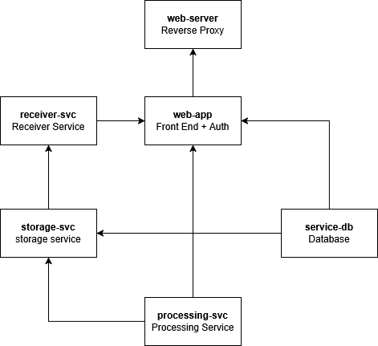

# Project 1
# Technical Documentation

# Overview
Our project is based on options. This is a web app that is dedicated to a cookie shop. Once authenticated, a user can report the bakery’s customers, number of cookies sold, and income for the day. Every sales report is processed to generate a statistics page featuring the max, min, average, and total of every stat.

# Structure
Our project is a modified version of option one and is based on the on-going project from ACIT 3855 service based architecture.

# Services
## web-server
Edge service for the entire application. A simple Caddy container configured as a reverse proxy for the web app. This was done by mapping `/etc/caddy` to a volume containing a Caddyfile. Exposes port 80

## web-app
Express.js web app that handles routing and authentication. It only makes connections to the database to register and authenticate users. To store data and access summary stats, it makes requests to the receiver service and processing service respectively.

The Dockerfile for the web-app is based on the `node:22-alpine` image and only install required packages and expose port 3001.

### Authentication
Authentication is handled by Passport.js. The service only accpets usernames and passwords. User information is stored on the database service `service-db` on the table `auth_db.User`. Passwords are hashed.
  
To access routes other than `/`, `/login`, and `/register`, users must be logged in.

### Routes
`/`
Generic index. Only links to login and registration.
  
`/login` and `/register`
Log in and register pages. Users must be logged in to access other routes.

`/sales/report`
Form for reporting today's customers, cookies sold, and income. Submission redirects to stats page. Submission makes a POST request to receiver service. 

`/sales/stats`
Dashboard that displays statsitics based on reports. Stats come from processor service.

## Python Services
All of the services use OpenAPI/Swagger to define the API. The package Connexion is used in the services to validate requests and responses against the API. API specification for each service is written in the `openapi.yaml` files their respective projects.

All Dockerfiles for Python-based services are based on the `python3.12.12-trixie` image and only install required packages and expose ports.

### receiver-svc
Flask API with one endpoint: 
- POST /sales. 
  - Validates a request containing customer, cookie sales, and income data and sends it to the storage service. 
  - Used by web app to validate reported data
Exposes port 8080.
  
### storage-svc
Flask API with two endpoints: 
- GET /sales
  - Gets all reported sales data between two points in time
  - Used by the processing service to pull new sales reports
- POST /sales
  - Receives new reports and inserts them to the database
  - Used by receiving service to store reports
Exposes port 8090
  
### processing-svc
Flask API with one endpoint:
- GET /stats
  - Returns statistics generated from the reported data
  - Used by web-app to fetch stats
Exposes port 8100
  
This service periodically requests the storage service for new records to process. To store the statistics, a simple JSON file is used because implementing a MongoDB container caused too many issues. Currently configured to run every 5 seconds.

## services-db
MySQL server with `sales_data` and `auth_db` databases. The storage service can only access the sales_data database, and the web app can only access the `auth_db` database.

In order to grant minimal privileges to the web-app and storage-svc, two users need to be created in the database. The official MySQL Docker images can only create one user and database using .env files. We created a custom MySQL image that passes a SQL script to create the two users and databases. 

To make data persist when setting up and tearing down containers a volume is attached to `/var/lib/mysql`.

Exposes port 3306
  
### Databases and Tables
`auth_db.User`
- `username`, `password`
- accessed by DB user `"auth"@"%"`
- Used by web app to register and authenticate users
- passwords are hashed
  
`sales_data.sales`
- contains sales reports
- accessed by DB user `"sales"@"%"`
- Used by the storage service to store and retrieve sales data
  

# Docker Compose Deployment
## `.env` files
- `docker/app.env`
  - `MYSQL_CONN`
    - Connection string to the MySQL container
    - Credentials must match those in `mysql/setup.sql`
  
Once the entire project is downloaded and, deploy it by navigating to the `docker` director and use `docker compose up --build`
